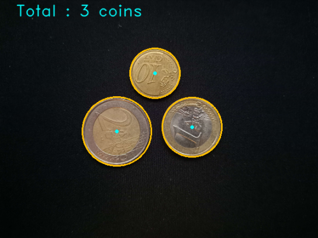
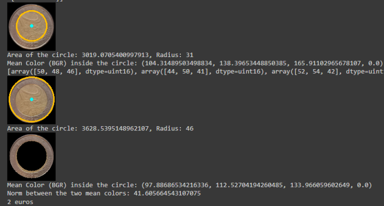

# Projet_intro_image

Ce dépot github est le rendu du projet : Détection et identification de pièces de monnaies en euros.
Toute les fonctions implémentées sont dans le fichier main.ipynb et les images dans le dossier data. 
Le fichier data_annotation.csv contient le nom des images, le nombre de pieces de ces images et la sommes de ces pieces en euros.

## Objectif

Concevoir un programme permettant, à partir de cette image donnée en entrée, de compter la somme (en euros) représentée.

## Exemple de résultat pour le comptage de pieces

## Exemple de résultat pour la detection de valeur de pieces

## Résultats 

Comptage de pieces : 69.34% d'image où les pieces sont correctement comptées.

Détection de valeur des pieces : MAE = 1.76 pour les images avec les pieces correctement comptées
